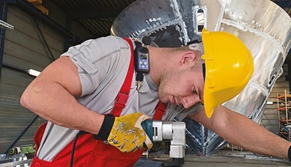
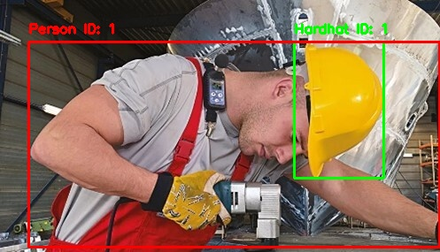

# Hard Hat Detection Using a Pretrained YOLOv8 Model

## CIV1287: Virtualization and Analytics in Construction  
### Coding Assignment: AI-Assisted Construction Analytics

---

## 1. Introduction

This project implements a pretrained YOLOv8 object detection model to support safety monitoring in construction projects. The main objective is to detect whether workers are wearing hard hats in construction-related images.

Hard hats are an important part of personal protective equipment (PPE) on construction sites. Detecting missing or improperly used hard hats can help improve site safety monitoring and reduce the risk of injuries. Instead of training a machine learning model from scratch, this project uses an existing pretrained model and adapts it into a simple AI-assisted workflow.

The original pretrained hard-hat detection model used in this project was obtained from the following GitHub repository:

[Original Hard Hat Detection Repository](https://github.com/nosterdream/hard-hat-detection/tree/master#model)

This project focuses on using the pretrained model, organizing the input and output workflow, testing the model on different images, and evaluating its performance using simple quantitative and qualitative measures.

---

## 2. Project Objective

The objective of this project is to develop a working AI-assisted workflow using a pretrained computer vision model for a construction-related safety application.

The specific goals are:

- Use a pretrained YOLOv8 model for hard-hat detection.
- Provide construction-related input images.
- Process the images using a Python script.
- Generate output images with bounding boxes.
- Evaluate the model performance using simple accuracy calculations.
- Reflect on the role of AI-assisted development in engineering workflows.

---

## 3. Repository Structure

The project repository is organized as follows:

```text
HARD_HAT_DETECTION/
│
├── .vscode/
│
├── input_files/
│   └── Input images used for testing the model
│
├── models/
│   ├── last_hardhat_200_epochs.pt
│   └── yolov8x.pt
│
├── output_files/
│   └── Processed images with detection results and bounding boxes
│
├── trackers/
│   └── Detection-related Python modules
│
├── utils/
│   └── Utility functions for reading and saving images/videos
│
├── main.py
│
└── README.md
````

### Folder Explanation

#### `input_files/`

This folder contains the images used to test the hard-hat detection model. A total of 20 images were added to this folder. The images were collected from web browsing and included some construction-related job site conditions.

#### `models/`

This folder contains the pretrained model files used in the project.

* `last_hardhat_200_epochs.pt`: pretrained hard-hat detection model.
* `yolov8x.pt`: YOLOv8 model used for person/object detection.

[Link to the models](https://utoronto-my.sharepoint.com/:f:/g/personal/j_peinado_mail_utoronto_ca/IgDVMJ5cgjyMQbG6llMMN_JKAaao4b7DFbX9fM81DvzQRnk?e=wSvFXx)

#### `output_files/`

This folder contains the processed images generated by the script. These images include the model predictions and bounding boxes around detected workers and hard hats.

#### `trackers/`

This folder contains the Python classes and functions used to run the hard-hat and person detection process.

#### `utils/`

This folder contains helper functions for reading input images/videos and saving processed outputs.

---

## 4. AI-Assisted Workflow

The workflow follows a simple input → processing → output structure.

### 4.1 Input Section

The input data consists of construction-related images placed inside the `input_files/` folder. These images were used to test whether the pretrained model could detect hard hats correctly.

### 4.2 Processing Section

The Python script loads the pretrained YOLOv8 hard-hat model and processes each input image. The model identifies hard hats and draws bounding boxes around detected objects.

The general processing logic is:

1. Read the input image.
2. Load the pretrained hard-hat detection model.
3. Run object detection on the image.
4. Draw bounding boxes around detected hard hats and people.
5. Save the processed image into the `output_files/` folder.

### 4.3 Output Section

The output images are saved in the `output_files/` folder. These processed images visually show the detected objects using bounding boxes.

The output results allow the user to review whether the model correctly detected the hard hats in each image.

---

## 5. Model Used

The project uses a pretrained YOLOv8 object detection model.

YOLO, which stands for “You Only Look Once,” is a computer vision model designed to detect objects in images and videos. In this project, the model is used to detect hard hats and support safety monitoring in construction environments.

The pretrained model was not developed from scratch in this project. Instead, it was implemented as part of an AI-assisted workflow. This approach reflects the assignment objective of using existing AI tools to solve a construction-related problem.

---

# Part A: Implementation Task

## A.1 Implementation Summary

A working AI-assisted workflow was developed using a pretrained YOLOv8 hard-hat detection model. The system takes construction-related images as input, processes them through the pretrained model, and generates output images with bounding boxes.

The workflow includes:

* Input images stored in the `input_files/` folder.
* Pretrained model files stored in the `models/` folder.
* Python script used to process the images.
* Output images stored in the `output_files/` folder.
* Visual results showing detected hard hats and workers.

## A.2 Input Data

A total of 20 images were used to test the model. The images included different construction-related conditions and worker appearances. Some images were collected through web browsing, while others represented more realistic job site conditions.

## A.3 Processing Method

The model was executed using a Python-based workflow. The script reads the input images, applies the pretrained YOLOv8 model, draws bounding boxes, and saves the processed results.

## A.4 Output Results

The output images showed bounding boxes around detected hard hats and workers. These outputs were reviewed manually to determine whether the detection result was correct or incorrect.






---

# Part B: Evaluation

## B.1 Qualitative Evaluation

Overall, the model performed well on the selected test images. The output images made sense because the detected hard hats were visually shown using bounding boxes. This made it easy to inspect the results and determine whether the model was correctly identifying hard hats.

The results are relevant to construction safety monitoring because hard-hat detection can support PPE compliance checks on job sites. In a real construction environment, this type of system could help engineers, supervisors, or safety personnel quickly identify whether workers are following basic PPE requirements.

The main limitation observed was that the model failed to detect the hard hat in one image. This shows that the model is not perfect and may miss detections depending on image quality, lighting, worker position, object visibility, or background conditions.

The model was relatively consistent across the tested images. However, because only 20 images were tested, the results should be interpreted as a basic image-level evaluation rather than a complete object-detection benchmark.

## B.2 Quantitative Evaluation

The model was tested using 20 images.

| Evaluation Metric              | Result |
| ------------------------------ | -----: |
| Total test images              |     20 |
| Correct detections             |     19 |
| Incorrect or missed detections |      1 |
| Image-level accuracy           |    95% |

The accuracy was calculated as:

```text
Accuracy = Correct detections / Total test images × 100
```

```text
Accuracy = 19 / 20 × 100 = 95%
```

Therefore, the model achieved an image-level detection accuracy of:

```text
95%
```

## B.3 Interpretation of Quantitative Results

The model correctly detected hard hats in 19 out of 20 images. This indicates that the pretrained YOLOv8 model performed well on the selected test dataset.

However, this result should be interpreted carefully. The test dataset was small, and the evaluation was based on visual review of the output images. A more rigorous evaluation would require a larger labeled dataset with ground-truth bounding boxes, true positives, false positives, false negatives, precision, recall, and mean average precision.

For the purpose of this assignment, the simple count-based accuracy calculation provides a clear and understandable performance measure.

## B.4 Key Limitations

The main limitations of this workflow are:

* The test dataset only included 20 images.
* The evaluation was based on image-level detection rather than detailed bounding-box comparison.
* The model may perform differently under poor lighting, occlusion, unusual camera angles, or crowded job site conditions.
* The model was not trained or fine-tuned specifically for the exact job site conditions used in this project.
* A real-world safety monitoring system would require more testing, validation, and integration with site safety procedures.

---

# Part C: Reflection

## Q1. AI-Assisted Development Experience

Using AI-assisted tools made the coding experience much faster. Instead of building the machine learning model from scratch, I was able to focus on understanding how to implement the pretrained model, organize the workflow, and interpret the results.

AI-assisted development made the process more accessible by helping with code structure, debugging, and explanations of how the model works.

## Q2. Where AI-Assisted Building Worked Well

AI-assisted tools were most useful for debugging the code, solving coding issues, and answering technical questions. They helped identify problems related to file paths, library versions, missing dependencies, and code organization.

They were also useful for improving the structure of the project and explaining how to connect the input images, model processing, and output results into a clear workflow.

## Q3. Where AI-Assisted Building Failed or Was Limited

The AI-assisted approach was limited when trying to develop a solution with real-world engineering value. Generative AI can help produce code and explanations, but it still requires many inputs, corrections, and prompts to generate a useful result.

The AI tool does not automatically understand the full construction context, job site conditions, safety requirements, or engineering judgment needed to validate the system. Therefore, the user still needs to guide the workflow, check the outputs, and decide whether the results are reasonable.

## Q4. Understanding vs. Dependence

I understood the general workflow of the project, including how input images are processed, how the model generates detections, and how output images are saved with bounding boxes.

However, I relied on generative AI for debugging and resolving technical issues, especially when library versions were not updated, dependencies did not match, or the code produced errors. I also relied on AI assistance to better understand how the pretrained YOLOv8 model could be implemented in a practical workflow.

## Q5. Engineering Judgment and Future Use

Human judgment is still very important because engineers understand real-world scenarios, safety risks, site conditions, and practical limitations better than an automated model. AI can produce working outputs, but it does not fully understand construction operations, worker behavior, environmental conditions, or the consequences of incorrect detections.

Humans also bring creativity, experience, and the ability to connect different types of information. Our judgment is needed to decide whether AI results are useful, safe, and appropriate for engineering practice.

In the future, I would use tools like this to improve work quality and expand the scope of engineering workflows. For example, AI-assisted computer vision could help support construction site monitoring, PPE compliance checks, productivity analysis, and safety documentation. I also believe that generative AI will continue evolving into more advanced agents that help engineers automate repetitive tasks, improve decision-making, and develop better technical solutions.

---

# Conclusion

This project demonstrated how a pretrained YOLOv8 model can be used in a simple AI-assisted workflow for construction safety monitoring. The system successfully processed construction-related images and generated output images with bounding boxes around detected hard hats.

The model achieved a basic image-level accuracy of 95% on a test set of 20 images. Although the result is promising, the workflow has limitations because the dataset was small and the evaluation was based on simple visual inspection.

Overall, the project shows that pretrained AI tools can be useful in construction engineering applications, but they must be supported by human judgment, careful validation, and realistic understanding of job site conditions.


